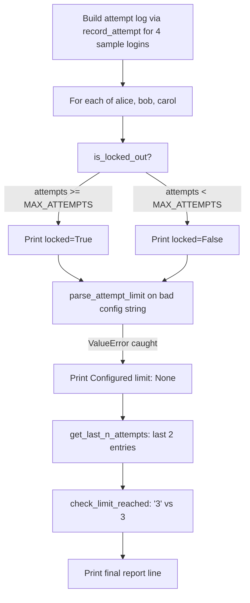

# Week 3 Explanation: Fix the Bugs (and Prove It with pytest)

## (a) How you'd get there - the thought process

The very first question with any bug hunt isn't "what's wrong with this
line" - it's **"what is this function actually supposed to do, and does
that match what the failing test expected?"** The pytest output already
answers half of that for you: it shows the expected value, the actual
value, and the line number. So the workflow that gets you through five
bugs without getting lost is:

1. Read one failure at a time (not all three at once - your brain will
   start mixing up which output belongs to which bug).
2. Before touching code, restate in one sentence what the function
   *should* do, based on its docstring and the test's assertion.
3. Trace the current code by hand against the test's input, the way
   `count_attempts` was traced in the challenge brief, to find exactly
   where the actual behavior diverges from the intended behavior.
4. Fix only that one thing, re-run pytest, confirm that specific test
   goes green, and only then move to the next failure.

**Where a naive first attempt snags:** it's tempting to look at
`is_locked_out` and `get_last_n_attempts` failing and assume they share
one root cause, since they're near each other in the file. They don't -
one is a comparison operator bug (`>` vs `>=`), the other is a loop
range bug (`range(len(log) - n, len(log) - 1)`). Bundling them into one
"attempts logic must be broken" hypothesis costs time; tracing each
function independently, against its own docstring and its own test, is
what actually separates them.

**A second snag** is more of a design lesson than a debugging one: the
`start_session(log=[])` bug is invisible until you specifically test
"call it twice, does the second call really start empty?" If you only
ever tested `start_session()` once and inspected the result, it would
look completely correct - the bug only appears through *repeated calls
sharing state*. That's exactly why mutable default arguments are a
famous Python gotcha: they pass a casual glance and fail under exactly
the usage pattern (calling a function more than once) that real
programs do constantly.

## (b) Hand-traced example

Take `is_locked_out(["bob", "bob", "bob"], "bob")` against the buggy
version:

- `count_attempts` walks the log: `"bob"=="bob"` three times ->
  `attempts = 3`
- buggy check: `3 > 3` -> `False` -> function returns `False`
- but the test expects `True` - bob has 3 failed attempts and
  `MAX_ATTEMPTS = 3`, so he should be locked out *now*, not after a
  4th attempt

After the fix (`attempts >= MAX_ATTEMPTS`): `3 >= 3` -> `True` ->
matches the test.

**Reference test file** - here's what good additional tests (the ones
the challenge asked you to write yourself) look like, including a
`@pytest.mark.parametrize` example:

```python
import pytest
from week03_solution import parse_attempt_limit, check_limit_reached


def test_parse_attempt_limit_returns_none_for_bad_input():
    """A non-numeric config value should return None, not crash."""
    assert parse_attempt_limit("not_a_number") is None


def test_parse_attempt_limit_parses_valid_numbers():
    assert parse_attempt_limit("5") == 5


@pytest.mark.parametrize(
    "attempts_str, limit, expected",
    [
        ("3", 3, True),
        ("2", 3, False),
        ("0", 0, True),
        ("10", 3, False),
    ],
)
def test_check_limit_reached_parametrized(attempts_str, limit, expected):
    """One test function, run once per row in the list above - this is
    the standard way to check the same logic against several inputs
    without copy-pasting the test body four times."""
    assert check_limit_reached(attempts_str, limit) is expected
```

If you wrote something close to this, you've got the pattern. If your
`parse_attempt_limit` test didn't use `is None` - `== None` also works
in Python, but `is None` is the idiomatic form pytest and most style
guides expect, since `==` can in principle be overridden by a custom
`__eq__` while identity comparison against the singleton `None` cannot.

## (c) Key new library/pattern, and common mistakes

**New skills this week:** reading pytest's failure output as a
debugging tool (not just a pass/fail signal), writing `assert`-based
test functions, `@pytest.mark.parametrize` for testing one function
against many inputs, and reading a traceback to identify the *actual*
exception type raised versus the one your code expects.

**Common mistakes to avoid:**
- Fixing multiple bugs at once "because you can see them all already" -
  you lose the ability to confirm each fix actually did what you think
  it did, and if a fix is wrong you won't know which one.
- Reaching for a bare `except:` to "make the crash go away" instead of
  catching the specific exception type the code actually raises -
  that hides real bugs instead of fixing them.
- Using a mutable object (`[]`, `{}`, a class instance) as a default
  argument value for anything that will be mutated. If you need an
  "empty" default, use `None` and build the real default inside the
  function body.
- Comparing values of different types (`str` vs `int`) with `==` and
  assuming Python will coerce them - it won't; you must convert
  explicitly.

## (d) Reference flowchart for this week's solution

This is the first week the flowchart habit applies, so here's a
reference diagram of what `main()` actually does, post-fix, to compare
against your own:



Notice this diagram only has one real decision diamond (`is_locked_out`)
even though the script touches five functions - `parse_attempt_limit`,
`get_last_n_attempts`, and `check_limit_reached` are sequential steps,
not branches. If your diagram turned every function call into a
diamond, that's worth adjusting: a diamond means "the next step depends
on this," not just "a function ran here."
