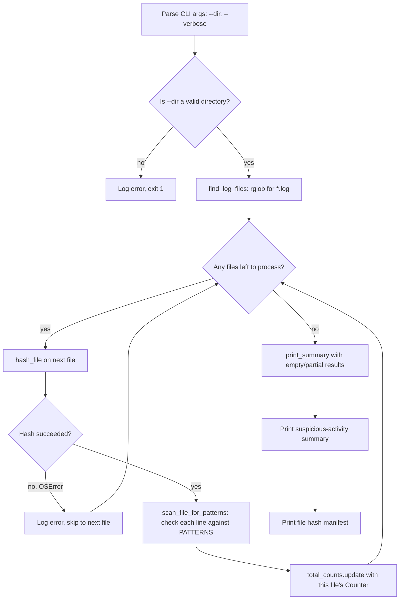

# Week 4 Explanation — Capstone: Mini Log Auditor CLI

## (a) How you'd get there — the thought process

The trap in a "combine everything" week is trying to write one big function that
does argument parsing, file walking, hashing, regex scanning, and reporting all
at once. The first question to ask isn't "how do I scan a log line" (you already
know that from week 1) -- it's **"what are the separate jobs here, and what does
each one hand to the next?"**

Laid out as jobs:

1. Get a directory from the user (argparse).
2. Find every log file in it (pathlib).
3. For each file: fingerprint it (hashlib) *and* scan its lines for trouble (re).
4. Combine everything found across *all* files into one tally (Counter).
5. Print a report.

That ordering matters: steps 2-4 are naturally a loop over files, but hashing a
file and scanning a file are two *independent* things you do to the same file --
which is why they're two separate functions (`hash_file`, `scan_file_for_patterns`)
rather than one `process_file` function that does both. If a future version only
needed hashing, or only needed scanning, that split lets you reuse half the work
without touching the other half. This is the same "one job per function" instinct
from weeks 1-2, just applied at a bigger scale.

**Why `Counter` instead of a plain dict?** A plain dict makes you write
`counts[label] = counts.get(label, 0) + 1` (or check `if label not in counts` first)
every time you record a hit. `Counter` gives you `counts[label] += 1` directly on
a key that doesn't exist yet (it defaults to 0), and its `.most_common()` method
sorts your findings by frequency for free -- exactly what a "summary" report needs.
Reaching for a dict here isn't wrong, but you end up rebuilding a worse version
of `Counter` by hand.

**Where a naive first attempt snags:** the obvious first draft scans a file with
`path.read_text().splitlines()`. That works fine on the sample data -- and then
quietly breaks the moment a log file has one byte that isn't valid UTF-8 (common
in real-world logs with binary garbage in them), raising `UnicodeDecodeError` and
killing the whole audit run over one bad file. You'd notice this by testing
against a file with an intentionally malformed byte, or just by remembering
week 3's lesson: *any* file I/O can fail in ways I don't control, so it belongs
inside a `try/except`. The fix here is two-fold: open with `errors="replace"` so
a bad byte becomes a placeholder character instead of a crash, *and* wrap the
read in `try/except OSError` so a totally unreadable file (permissions, file
deleted mid-scan, etc.) gets logged and skipped rather than taking down the
whole audit.

## (b) Hand-traced example

Suppose `sample_logs/` contains one file, `auth1.log`, with these three lines:

```
Jan 10 10:00:01 host sshd[100]: Failed password for admin from 10.0.0.5 port 51000 ssh2
Jan 10 10:00:02 host sshd[101]: Accepted password for paul from 10.0.0.9 port 51010 ssh2
Jan 10 10:00:03 host sshd[102]: Failed password for invalid user root from 10.0.0.5 port 51020 ssh2
```

Tracing `audit_directory(Path("sample_logs"))`:

| Step | State |
|---|---|
| `find_log_files()` returns | `[Path("sample_logs/auth1.log")]` |
| `hash_file(auth1.log)` returns | `"a1b2c3...` (some 64-char hex string) |
| `file_hashes` after this file | `{"sample_logs/auth1.log": "a1b2c3..."}` |
| `scan_file_for_patterns` — line 1 | `"failed password"` regex matches → `hits = Counter({"failed_login": 1})` |
| `scan_file_for_patterns` — line 2 | no pattern matches → `hits` unchanged |
| `scan_file_for_patterns` — line 3 | `"failed password"` matches → `hits["failed_login"] = 2`; `"invalid user"` also matches → `hits["invalid_user"] = 1` |
| `scan_file_for_patterns` returns | `Counter({"failed_login": 2, "invalid_user": 1})` |
| `total_counts.update(file_counts)` | `total_counts = Counter({"failed_login": 2, "invalid_user": 1})` |

Final `print_summary` output:

```
=== Suspicious Activity Summary ===
  failed_login              2
  invalid_user              1

=== Files Audited (1) ===
  sample_logs/auth1.log
    sha256: a1b2c3...
```

Notice `failed_login` printed before `invalid_user` -- that's `most_common()`
sorting by count, not insertion order.

## (c) Key new library/pattern, and common mistakes

**New this week:** `collections.Counter`. Three things worth remembering:

- `Counter()[missing_key]` returns `0` instead of raising `KeyError` -- this is
  what makes `counts[label] += 1` safe on a brand-new label.
- `counter_a.update(counter_b)` *adds* `counter_b`'s counts into `counter_a` (it
  does **not** replace them, and it is not the same as `dict.update`, which would
  overwrite each key). This is the correct way to merge per-file counts into a
  running total across a loop.
- `.most_common()` (no argument) returns *all* entries sorted by count descending;
  `.most_common(3)` returns just the top 3. Both are far less code than sorting a
  dict's `.items()` by hand with a `key=` lambda.

**Common mistakes to avoid:**

- Re-declaring `Counter()` *inside* the per-file loop for the *total*, instead of
  once before the loop starts -- that resets your running total back to empty on
  every file.
- Using `dict.update()` where you meant `Counter.update()` -- on a plain dict,
  `.update()` overwrites matching keys with the new value rather than summing
  them, silently producing wrong totals.
- Forgetting that `rglob("*.log")` walks subdirectories while `glob("*.log")`
  only looks at the top level -- easy to test against a flat sample directory
  and miss this until a subfolder shows up later.
- Letting one corrupted or permission-denied file `raise` out of the loop and
  abort the whole run, instead of catching, logging, and continuing to the next
  file.

## (d) Reference flowchart for this week's solution

This is the flowchart the "Plan It First" step should have produced *before*
writing `audit_directory`. Compare it against whatever you sketched -- the shape
matters more than exact labels.



The key branch to get right is the one many first drafts skip: **"did this
file fail?"** appearing *inside* the per-file loop, routing back to "any files
left?" instead of falling straight through to the report. That's the diagram
making the try/except's control flow visible before a single line of code
existed.
