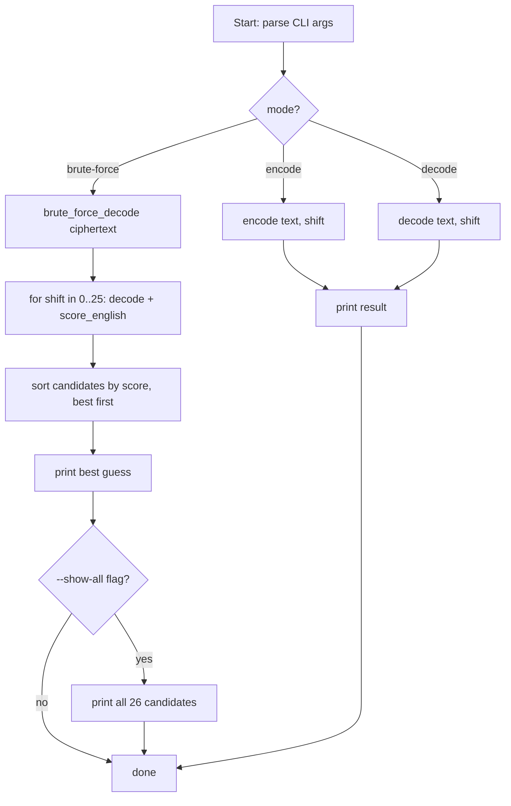

# Week 5 Explanation -- Caesar Cipher Toolkit

## (a) How you'd get there -- the thought process

**First question to ask:** what's the one atomic operation everything else is
built from? Here it's "shift one character." Encoding a whole string,
decoding a whole string, and brute-forcing an unknown shift are all just
that one operation applied differently -- so `shift_char()` gets written
and gotten *right* first, before anything else touches it.

**Why `ord()`/`chr()` arithmetic with modulo, instead of a translation
table?** A translation-table approach (e.g. building a shifted copy of
`string.ascii_lowercase` with slicing and using `str.maketrans`) is
arguably more "Pythonic" and worth knowing. But a tiny pure function like
`shift_char()` makes the case-check, the offset math, and the wraparound
all visible in one place you can step through by hand -- and it makes the
"decode is just encode with a negative shift" trick obvious, which saves
you from writing (and debugging) two separate cipher implementations.

**Where a naive first attempt snags:** if you don't special-case
non-alphabetic characters, `encode("Attack at dawn!", 3)` will try to shift
the space and the `!` through the same `ord()` arithmetic as a letter and
produce garbage in those positions. The way to notice this *before* it
becomes a mystery bug later is to hand-trace one short, mixed-case,
punctuated example early -- exactly what section (b) below does -- rather
than only testing with a single all-lowercase word.

**Brute force needs a decision, not just a loop:** trying all 26 shifts is
the easy part. The real design question is "how does the program decide
which of the 26 results is *actually* English?" Two common approaches:
(1) count how many decoded words appear in a dictionary of common English
words, or (2) compare the ciphertext's letter-frequency distribution
against known English letter frequencies (a chi-squared-style statistic).
Chi-squared was chosen here because it needs no external word list, still
works on short or slightly garbled text, and is the same statistical
technique you'll reuse for XOR key recovery later in the series (topic 7)
-- so it's worth building real intuition for now.

**The snag inside the scoring function itself:** a true chi-squared
statistic is *smallest* for a good match. If you don't notice that and
just `max()` the raw chi-squared values, your brute-forcer will
confidently return the *worst* shift every time -- and it'll look like it
"runs fine," it just always picks shift=0 or garbage. The fix used here is
to negate the value once, right where it's computed, so "higher score =
better" holds everywhere else in the code. This is exactly the kind of bug
that's invisible by reading the code casually and only shows up when you
hand-trace one known input/output pair -- which is why that's step one of
verifying brute force, not an afterthought.

## (b) Hand-traced example

**Step 1 -- `encode("HAL", 1)`** (a classic shift-cipher example):

| char | base | ord(char)-base | +1 | mod 26 | result |
|------|------|-----------------|----|--------|--------|
| H    | 'A'=65 | 7 | 8 | 8 | I |
| A    | 'A'=65 | 0 | 1 | 1 | B |
| L    | 'A'=65 | 11 | 12 | 12 | M |

Result: `"IBM"`.

**Step 2 -- `encode("meet at dawn", 5)`** (builds the ciphertext used to test
brute force):

| char | offset | +5 | mod 26 | result |
|------|--------|----|--------|--------|
| m | 12 | 17 | 17 | r |
| e | 4  | 9  | 9  | j |
| e | 4  | 9  | 9  | j |
| t | 19 | 24 | 24 | y |
| (space) | -- | -- | -- | (space, unchanged) |
| a | 0  | 5  | 5  | f |
| t | 19 | 24 | 24 | y |
| (space) | -- | -- | -- | (space) |
| d | 3  | 8  | 8  | i |
| a | 0  | 5  | 5  | f |
| w | 22 | 27 | 1  | b |
| n | 13 | 18 | 18 | s |

Ciphertext: `"rjjy fy ifbs"`.

**Step 3 -- `brute_force_decode("rjjy fy ifbs")`**. For each shift 0-25,
`decode()` is applied and `score_english()` is computed. A few
representative rows of the resulting `candidates` list:

| shift | decoded text     | score (higher = better) |
|-------|------------------|--------------------------|
| 0     | rjjy fy ifbs     | very negative (gibberish) |
| 3     | oggv cv fcyp     | very negative |
| **5** | **meet at dawn** | **closest to 0 -- best match** |
| 12    | fyyl qy tqun     | very negative |

After `candidates.sort(key=..., reverse=True)`, index `[0]` is the shift-5
row, so `best_shift = 5` and `best_plaintext = "meet at dawn"` -- matching
the original plaintext from Step 2. (This exact round trip is asserted in
the solution file's self-check.)

## (c) Key library/pattern demonstrated, and common mistakes

- **`ord()` / `chr()` with modulo arithmetic** for cyclic alphabets --
  the same "wrap around a fixed-size range" pattern shows up anywhere you
  rotate through a fixed set of values.
- **`collections.Counter`** for quickly tallying letter frequency instead
  of hand-rolled dictionaries with `.get(key, 0) + 1` bookkeeping.
- **argparse subparsers** (`dest='mode', required=True`), carried forward
  from L1 -- the same shape will keep reappearing all series.
- **A statistical "does this look like English" scorer** (chi-squared
  against reference letter frequencies) -- a lightweight, dependency-free
  technique that generalizes well beyond Caesar ciphers.

**Common mistakes to watch for:**
- Forgetting the `% 26` wraparound (shifting `'z'` forward without modulo
  produces an invalid `chr()` value or the wrong letter).
- Not preserving case, or not skipping non-alphabetic characters.
- Getting the sign backwards in the scoring function (see the chi-squared
  snag above) -- always sanity-check a scorer against one known-good and
  one known-bad input before trusting it in a loop.
- Not testing the round trip: `decode(encode(x, s), s) == x` for a handful
  of shifts is a two-line test that catches most of the above at once.

## (d) Reference Mermaid flowchart for this week's solution

This week (week 5) was the first week required to include a Mermaid
flowchart in "Plan It First." Here's a reference flowchart for how the
finished solution actually flows, to compare against what you sketched
before coding:

If your own diagram looks meaningfully different -- for example, if it
didn't separate "compute all 26 candidates" from "pick the best one" as
distinct steps -- that's a useful signal about where your mental model of
the program diverged from how it was actually built. That gap is exactly
what this habit is for.
