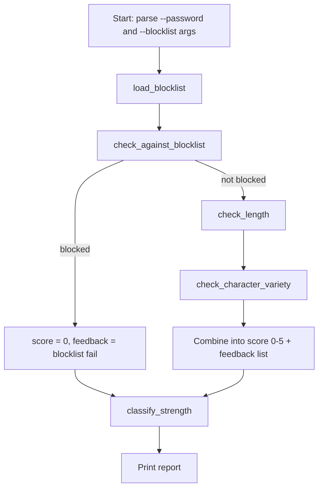

# Week 6 Explanation — Password Strength Auditor

## (a) How you'd get there — the thought process

**First question to ask:** "What are the independent things I'm checking, and can each one be its own yes/no function?" A password audit is really three separate questions bolted together — is it long enough, does it use enough character variety, is it a known-bad password — so the natural decomposition is one small function per question, plus one function that combines their results into a score.

**Why a `dict` for character variety instead of four separate booleans floating around?**
A first instinct might be:

```python
has_lower = bool(re.search(r"[a-z]", password))
has_upper = bool(re.search(r"[A-Z]", password))
has_digit = bool(re.search(r"\d", password))
has_symbol = bool(re.search(r"[^\w\s]", password))
```

That works, but the moment you want to report *which* classes are missing, or count how many are present, you're stuck writing `[has_lower, has_upper, has_digit, has_symbol].count(True)` — clunky, and the names have no structure. Returning `{"lowercase": True, "uppercase": False, ...}` from `check_character_variety()` gives you a single value you can iterate, filter (`[k for k, v in variety.items() if not v]`), and count (`sum(variety.values())`) — the dict *is* the report, not just an intermediate step.

**Where a naive first attempt snags:** the blocklist check. A first pass might do `if password in blocklist: score = 0`, using the blocklist as loaded from the file with whatever casing the user typed it in. Try it against `"Password1"` when the blocklist has `"password1"` — it won't match, and you've shipped a checker that a trivial capitalization change defeats. The fix is normalizing case on *both* sides — lowercase the blocklist once at load time (`load_blocklist`), and lowercase the password being checked at comparison time (`check_against_blocklist`). This is a good example of a bug you'd only notice by tracing a concrete example through the code (see part (b) below) rather than by reading the code and assuming it's correct.

**Why score = 0 outright for a blocklisted password, rather than just subtracting points?** A password can be long and have every character class and still be terrible — `Password1!` passes length and variety checks easily but is a top-10 guessed password. If blocklist membership only cost a couple of points, a blocklisted password could still land in "MODERATE." The rule needs to be an override, not an additive penalty, because "known to attackers" isn't a matter of degree.

## (b) Traced example

Input: `password = "Passw0rd"`, default blocklist (built-in only, no `--blocklist` file).

1. `load_blocklist(None)` → returns the default set, lowercased:
   `{"password", "password1", "123456", ..., "abc123", ...}` — note `"passw0rd"` (with a zero) is *not* in this list, so it won't get caught by the blocklist stage. Worth noting as a real limitation: leetspeak substitutions defeat a plain-string blocklist. (A hint in the challenge flags this as a stretch idea — normalizing `0`→`o`, `3`→`e` etc. before the blocklist check.)

2. `check_against_blocklist("Passw0rd", blocklist)`:
   `"passw0rd" not in blocklist` → `True` (not blocked) → audit continues.

3. `check_length("Passw0rd")`:
   `len("Passw0rd")` = 8, `8 >= 12` → `False`.
   Returns `(False, "Too short (8 chars, need at least 12)")`.
   `feedback = ["WARN: Too short (8 chars, need at least 12)"]`, `score = 0` so far.

4. `check_character_variety("Passw0rd")`:
   - lowercase: `re.search(r"[a-z]", ...)` finds `a`, `s`, `w`, `r`, `d` → `True`
   - uppercase: finds `P` → `True`
   - digit: finds `0` → `True`
   - symbol: no match → `False`
   Returns `{"lowercase": True, "uppercase": True, "digit": True, "symbol": False}`.

5. Back in `score_password`:
   `classes_present = sum(variety.values())` = 3 (lowercase + uppercase + digit).
   `missing = ["symbol"]` → feedback gets `"WARN: missing character classes: symbol"`.
   `score += min(3, 3)` → `score = 0 + 3 = 3`.
   Final `feedback.append("PASS: not found in blocklist")`.

6. `classify_strength(3)` → `3 <= 3` → `"MODERATE"`.

Printed report:
```
Password strength audit
------------------------------
  WARN: Too short (8 chars, need at least 12)
  WARN: missing character classes: symbol
  PASS: not found in blocklist
------------------------------
Score: 3/5  ->  MODERATE
```

This traces cleanly to the takeaway: `"Passw0rd"` *looks* strong to a human (mixed case, a digit) but the tool correctly flags it as only MODERATE because it's short and has no symbol — exactly the gap between "looks complex" and "is actually strong" that length-based modern guidance (NIST 800-63B) points at.

## (c) Key new library/pattern demonstrated, and common mistakes to avoid

- **`re.search` with character classes** (`[a-z]`, `[A-Z]`, `\d`, `[^\w\s]`) as a fast presence check — you don't need `re.findall` or counting when you only care "does at least one exist."
  - Common mistake: using `[^\w]` for "symbol" and forgetting that `\w` already excludes whitespace but *underscore counts as a word character* — so `[^\w]` alone would flag a space as a "symbol." Using `[^\w\s]` (not-word-char AND not-whitespace) avoids that trap.
- **Case-insensitive matching by normalizing at the boundary** (lowercase once on load, lowercase once on check) rather than trying to make the comparison itself case-insensitive inline every time. Normalize early, compare plainly.
- **Returning `(bool, message)` tuples** from small check functions is a lightweight pattern for "pass/fail plus why" without needing a custom class — good enough for a tool this size; a larger program might upgrade this to a small `CheckResult` dataclass.
- Common mistake to avoid in your own attempt: don't let `main()` grow logic. `main()` here only does argument parsing and two function calls — all the actual decision-making lives in testable, single-purpose functions. If you found yourself debugging inside an `if __name__ == "__main__":` block, that's a sign logic snuck into `main()` that belongs in its own function.

## (d) Reference flowchart for this week's solution

This is what a flowchart sketched *before* writing `week06_solution.py` might reasonably have looked like — compare it against your own week 6 diagram, not as a "correct answer" (there's more than one reasonable decomposition) but as a sanity check that your diagram's shape matches the control flow you actually built.



Note the branch at `check_against_blocklist`: it's the one place the flow genuinely forks (blocked passwords skip straight to a score of 0 and never reach the length/variety checks). If your own diagram drew that as a straight line instead of a decision diamond, that's worth revisiting — it's exactly the kind of branch the flowchart habit is meant to catch *before* you're debugging it in code.
