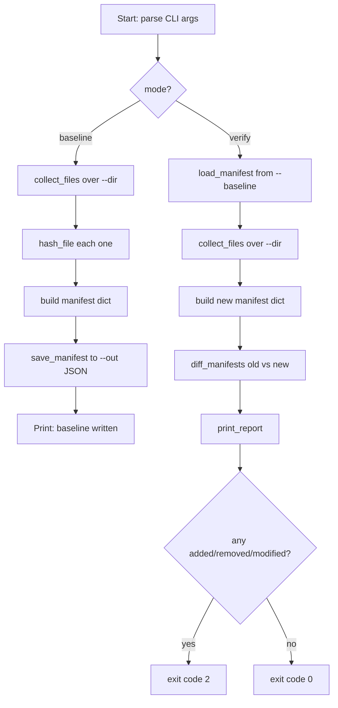

# Week 7 Solution Walkthrough — File Integrity Checker

## (a) How you'd get there

**First question to ask:** "What does 'compare two directories' actually reduce to?"
Not file-by-file diffing of contents — that's expensive and also not what you
want (you don't care *how* a file changed, just *that* it did). What you
actually want is a cheap fingerprint per file, so the real question becomes:
"what's a cheap fingerprint of a file's contents?" → a hash. That's the whole
insight that unlocks the design: once every file maps to one short string,
"did anything change" becomes a plain dictionary/set comparison, not a
filesystem comparison.

**Why a dict, not two lists:** a naive first attempt is often "walk the old
directory into a list of (path, hash) tuples, walk the new directory into
another list, then loop over both looking for matches." That's O(n²) and
awkward to reason about. The moment you store `{relative_path: hash}` instead,
you get `set(old.keys())` and `set(new.keys())`, and the three questions you
actually have — "what's new," "what's gone," "what changed" — map directly
onto set difference and set intersection. Recognizing "I have two collections
and need added/removed/common" as a set problem, not a loop problem, is the
transferable skill here.

**Where a naive attempt snags:** if you hash with `path.read_bytes()`, it
works fine on your 3 small sample files and then silently becomes a problem
the first time this script runs against a real directory with a large file
in it — the whole file gets pulled into memory at once. You wouldn't notice
in testing with tiny files; you'd notice in production with a memory spike
or a slowdown. The fix is reading in fixed-size chunks and feeding them into
the hash object incrementally (`hashlib.sha256()` + repeated `.update()`),
which is why `hash_file()` uses `iter(lambda: f.read(chunk_size), b"")`
instead of a one-shot read. Keep an eye out — this exact "don't assume it
fits in memory" instinct comes back explicitly in Week 10's ETL pipeline.

**Another snag:** using absolute paths as dictionary keys. If you baseline
`/home/paul/sample_files` and later verify `./sample_files` from a different
working directory, every key mismatches even though nothing changed. Storing
`path.relative_to(directory)` instead keeps the manifest portable.

## (b) Hand-traced example

Directory `sample_files/` contains `a.txt` ("hello") and `b.txt` ("world").

**`baseline` run:**

1. `collect_files(directory)` → `[Path('sample_files/a.txt'), Path('sample_files/b.txt')]`
2. `build_manifest` loops over those, calling `hash_file` on each:
   - `a.txt` → `5891b5b5...` (truncated)
   - `b.txt` → `e258d248...`
3. `manifest` = `{"a.txt": "5891b5b5...", "b.txt": "e258d248..."}`
4. `save_manifest` writes that dict to `baseline.json`.

Now suppose before `verify`, `a.txt` is edited to say "modified", `b.txt` is
deleted, and a new file `c.txt` ("new") is added.

**`verify` run:**

1. `old_manifest = load_manifest(baseline.json)` → the dict from step 3 above.
2. `new_manifest = build_manifest(directory)` →
   `{"a.txt": "<new hash>", "c.txt": "<hash of c.txt>"}`
3. `diff_manifests(old, new)`:
   - `old_paths = {"a.txt", "b.txt"}`, `new_paths = {"a.txt", "c.txt"}`
   - `added = new_paths - old_paths = {"c.txt"}`
   - `removed = old_paths - new_paths = {"b.txt"}`
   - `common = {"a.txt"}`
   - `old["a.txt"] != new["a.txt"]` → `modified = ["a.txt"]`
4. `print_report` shows: 0 unchanged, 1 modified (`a.txt`), 1 added (`c.txt`),
   1 removed (`b.txt`) — and the process exits with code `2` since drift was
   detected.

This matches the actual run used to sanity-check this solution before
delivery.

## (c) Key new library/pattern demonstrated, and common mistakes to avoid

- **`pathlib.Path.rglob("*")`** recursively walks a directory tree without
  manual `os.walk` bookkeeping; filtering with `.is_file()` skips
  subdirectories that `rglob` also yields.
- **`hashlib.sha256()` as an incremental object** — you don't have to have
  the whole input up front; you can feed it chunks over time, which is the
  pattern you'll reuse any time you hash something too big (or too slow) to
  materialize fully in memory.
- **Sets for "what changed between two snapshots"** — this pattern (two
  dicts keyed the same way, compared via `set` ops) shows up constantly in
  security tooling: comparing two scans, two configs, two IAM policies.
- **Common mistakes:**
  - Forgetting `rb` (binary mode) when opening files for hashing — text mode
    can silently mangle bytes on some platforms.
  - Using mutable global state to accumulate the manifest instead of
    building and returning it — makes the functions harder to test in
    isolation (this is also why Week 3's bugs included a mutable-default-
    argument trap: shared mutable state that outlives a single call is a
    recurring source of subtle bugs).
  - Comparing manifests with `==` on the whole dict and reporting only
    "something changed" rather than breaking the diff into
    added/removed/modified — the aggregate report is the part a security
    engineer actually needs for triage.

## (d) Reference flowchart for Week 7's solution

This is the diagram you'd compare your own Week 7 flowchart against. Paste
it into [mermaid.live](https://mermaid.live) or a ```` ```mermaid ```` fenced
block in a `.md` file to render it.



Notice the shape: both subcommands share `collect_files` + `build_manifest`
as a common core, and only the branch at the top (`baseline` vs `verify`)
and what happens to the resulting manifest differ. If your own diagram
converged on two completely separate code paths with no shared pipeline,
that's worth revisiting — the duplication is a sign the common "walk +
hash" step wasn't factored out into its own function.
