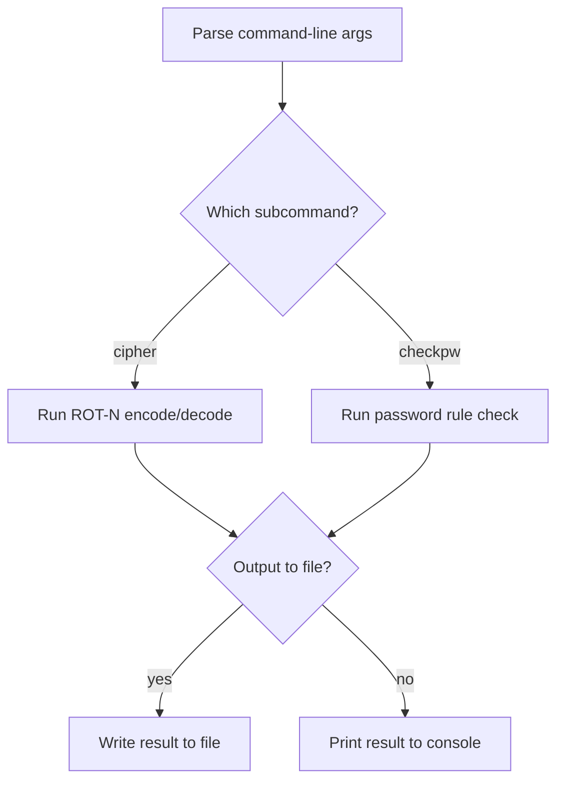

# Week 3: Fix the Bugs (and Prove It with pytest)

**Tier 0 - Level-Up Phase**

## Problem Statement

`week03_starter.py` is a small login-attempt tracking tool. It has
**five** planted bugs. Your job is not to rewrite the script - it's to
find each bug, fix it in place, and prove each fix with a test.

This week is also your first hands-on introduction to `pytest` as a
tool, and the first week where "Plan It First" includes sketching a
quick flowchart before you touch the bugs.

## Setup

```
pip install pytest
```

## Learning Objectives

- Reading a Python traceback and using it to find the actual line and
  cause of a failure (not just the symptom).
- Systematic debugging: fix one bug, re-run, confirm, move to the next -
  never fix five things at once and hope.
- **Writing and reading pytest tests**: running `pytest -v`, reading its
  failure output, writing your own `assert`-based test functions, and
  using `@pytest.mark.parametrize` to run one test against several
  inputs.
- A first, brief look at the `logging` module as an alternative to
  scattering `print()` calls through debugging code.
- The five specific bug categories: an off-by-one error, a mismatched
  `except` type, a mutable default argument, a logic error in a
  conditional, and a bad string/int comparison. These are common enough
  in real code that recognizing the *shape* of each one on sight is the
  actual goal, not just fixing these five instances.

## On the Job

Nobody hands you a diff that says "the bug is on line 47." In real
incident response and tool maintenance, you get a bug report, a stack
trace, or "this used to work and now it doesn't" - and a test suite
(when one exists) is the fastest way to pin down what actually broke
without re-reading the entire codebase from the top. This week
simulates that: you're handed working tests that fail, and your job is
to make the code match what they already know is correct.

## Plan It First

Before you touch any bug, do this:

1. **Read the whole script once, top to bottom, without editing
   anything.** For each function, write one sentence (on paper or in a
   scratch comment) describing what it's *supposed* to do - not what it
   currently does.
2. **Sketch a quick Mermaid flowchart** (`flowchart TD` or
   `flowchart LR` - plain text, no diagramming tool required) of what
   the script is supposed to do: `main()`'s call sequence, and where
   `is_locked_out()` branches on its condition. You're diagramming the
   *intended* behavior here, before bug-hunting - it gives you a
   reference to compare the buggy code against, one function at a time.
   **Include this diagram alongside your solution** when you share it
   in the challenge thread - it'll get compared against what you
   actually built during review.
3. **Run `pytest -v week03_test.py`** and read every failure message
   before changing any code. Note which function each failure points
   to.
4. **Run `python week03_starter.py` directly** too, and read its
   traceback. It will point you at a bug the tests don't cover.
5. Only now start fixing - one bug at a time, re-running pytest after
   each fix to confirm red turned to green before moving to the next.

### How to Write a Mermaid Flowchart

You haven't written one of these before, so here's everything you need.

**The opening line** declares the diagram type and layout direction:
`flowchart TD` (top-down) or `flowchart LR` (left-right). Either is
fine - pick whichever reads more naturally for your flow.

**Nodes** are steps or decisions, each given a short ID and a label:

- `A[Some action]` - a rectangle, used for a step or action.
- `B{Some question?}` - a diamond, used for a decision/branch point.

**Arrows** connect nodes to show flow: `A --> B` means "A leads to B."
For a decision node, label each outgoing arrow with the branch it
represents: `B -->|yes| C` and `B -->|no| D`.

**A tiny worked example** (not this week's challenge - this mirrors the
CLI dispatch flow from Week 1, which you already built and will
recognize):



That's the whole syntax set you need for this week: a start, one
decision, labeled branches, an end.

**Where to preview it:** paste it into
[mermaid.live](https://mermaid.live) for an instant render, or drop it
in a ` ```mermaid ` fenced code block inside a `.md` file - both GitHub
and VS Code's Markdown Preview render it natively, no extra tooling
needed.

## Worked Trace Example

Take `count_attempts(["alice", "bob", "alice"], "alice")`:

- `count = 0`
- entry `"alice"` == `"alice"` -> `count = 1`
- entry `"bob"` != `"alice"` -> unchanged
- entry `"alice"` == `"alice"` -> `count = 2`
- returns `2`

This function has no bug - tracing it first gives you a known-good
reference point for how the log is shaped before you start distrusting
every function in the file.

## Constraints

- Fix bugs in place - don't restructure the functions or rename them;
  `week03_test.py` imports them by their current names.
- Don't delete or rewrite the tests in `week03_test.py`. You may add
  new test functions below the existing ones.
- All three given tests, plus the two you write yourself, must pass.

## Example Usage / Expected Output

After all five bugs are fixed, `python week03_starter.py` should print,
with no traceback:

```
alice: locked=True
bob: locked=False
carol: locked=False
Configured limit: None
Last 2 attempts: ['bob', 'alice']
Limit reached ('3' vs 3): True
```

And `pytest -v week03_test.py` should show all tests passing (including
the two you add).

## Hints (graduated - try not to skip ahead)

1. One bug lives in a function signature, not a function body. Ask
   yourself what a default argument value actually is in Python -
   created once, or once per call?
2. Two bugs are boundary/matching errors: one compares with the wrong
   operator (`>` vs `>=`), and one loop range is shifted by exactly one
   position. Trace both by hand with a concrete small example, the way
   `count_attempts` is traced above.
3. Two bugs involve mismatched types: one function catches the wrong
   exception type (read the traceback from running the script directly
   - it names the exception actually raised), and one comparison checks
   equality between a `str` and an `int` that will never be `True` even
   when they "match" numerically.

## A Brief Note on Logging

Right now `main()` uses `print()` to show what's happening, which is
fine for a quick script but doesn't scale - you can't easily turn it
off, timestamp it, or route it to a file once a tool grows past a
handful of lines. The standard-library `logging` module solves this:

```python
import logging

logging.basicConfig(level=logging.INFO, format="%(levelname)s: %(message)s")
logging.info("Configured limit: %s", limit)
```

You don't need to convert this week's script over - just know that
`logging` exists as the "grown-up" replacement for debugging `print()`
calls, and you'll use it for real starting with next week's capstone.

## Using AI Tools

You're welcome to use AI tools (including Claude) to help you write
code for this challenge - to explain an error message, suggest a
refactor, or review your solution. The point of this series is that
*you* do the reasoning and *you* can explain why the code works, so use
AI as a second pair of eyes, not as a replacement for doing the
decomposition and tracing yourself.

## Ethics & Legal Reminder

This script only ever touches an in-memory list you construct yourself
- no real credentials, no real accounts, no network calls. Keep it that
way for every exercise in this series unless a specific week's brief
says otherwise: never point scanning, brute-force, or credential-
handling code at systems or accounts you don't own or don't have
explicit written permission to test.

---

*If this one takes longer than a week, no problem - just message me
anytime to push the schedule back and I'll pick up from wherever you
actually are.*
