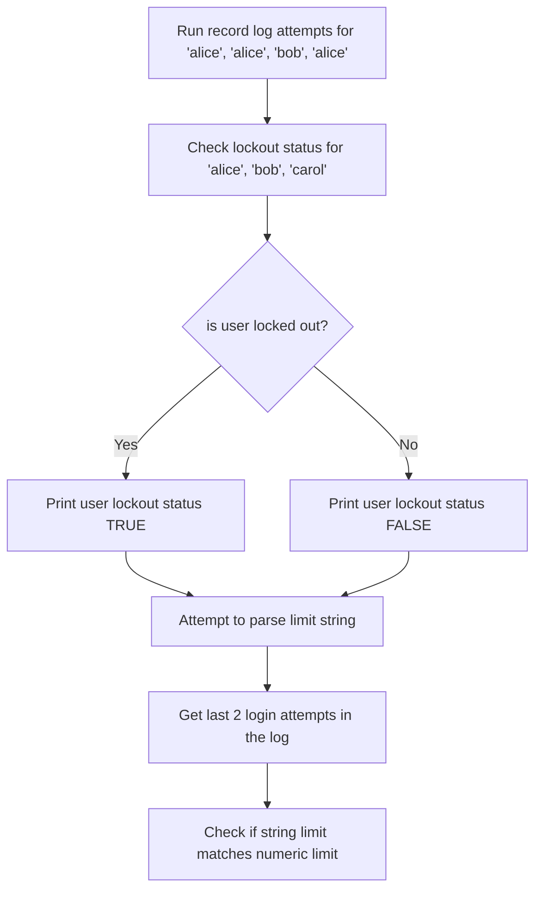

```mermaid
flowchart TD
A[Run record log attempts for 'alice', 'alice', 'bob', 'alice'] --> B[Check lockout status for 'alice', 'bob', 'carol']
B --> C{is user locked out?}
C -->|Yes| D[Print user lockout status TRUE] 
C -->|No| E[Print user lockout status FALSE]
D --> F[Attempt to parse limit string]
E --> F
F --> G[Get last 2 login attempts in the log]
G --> H[Check if string limit matches numeric limit]
```