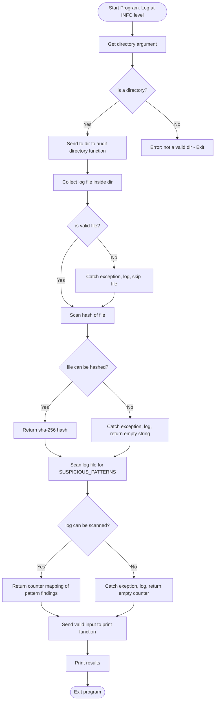

```mermaid
flowchart TD
A([Start Program. Log at INFO level]) --> B[Get directory argument]
B --> C{is a directory?}
C -->|Yes| D[Send to dir to audit directory function]
C -->|No| Exit1["Error: not a valid dir - Exit"]
D --> E[Collect log file inside dir] --> F{is valid file?}
F -->|Yes| G[Scan hash of file]
F -->|No| G1[Catch exception, log, skip file]
G1 --> G
G --> H{file can be hashed?}
H -->|Yes| I[Return sha-256 hash]
H -->|No| I1[Catch exception, log, return empty string]
I --> J[Scan log file for SUSPICIOUS_PATTERNS]
I1 --> J
J --> K{log can be scanned?}
K -->|Yes| L[Return counter mapping of pattern findings]
K -->|No| L2[Catch exeption, log, return empty counter]
L --> M[Send valid input to print function]
L2 --> M
M --> N[Print results]
N --> O([Exit program])
```
