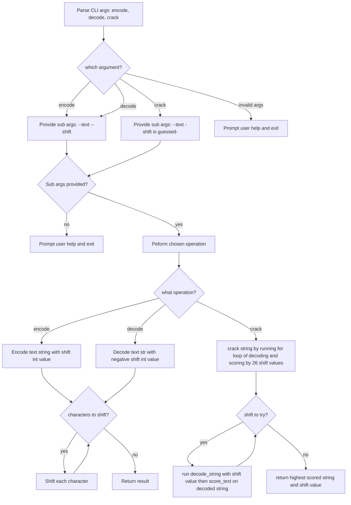

```mermaid
flowchart TD
    A[Parse CLI args: encode, decode, crack] --> B{which argument?}
    B -->|encode| C[Provide sub args: --text --shift]
    B -->|decode| C
    B -->|crack| D[Provide sub args: --text -shift is guessed-]
    B -->|invalid args| X[Prompt user help and exit]
    C --> E{Sub args provided?}
    D --> E
    E -->|no| F[Prompt user help and exit]
    E -->|yes| G[Peform chosen operation]
    G --> H{what operation?}
    H -->|encode| I[Encode text string with shift int value]
    H -->|decode| J[Decode text str with negative shift int value]
    I --> K{characters to shift?}
    J --> K
    K -->|yes| L[Shift each character]
    K -->|no| M[Return result]
    L --> K
    H -->|crack| N[crack string by running for loop of decoding and scoring by 26 shift values]
    N --> O{shift to try?}
    O -->|yes| P[run decode_string with shift value then score_text on decoded string]
    P --> O
    O -->|no| Q[return highest scored string and shift value]
    
```

