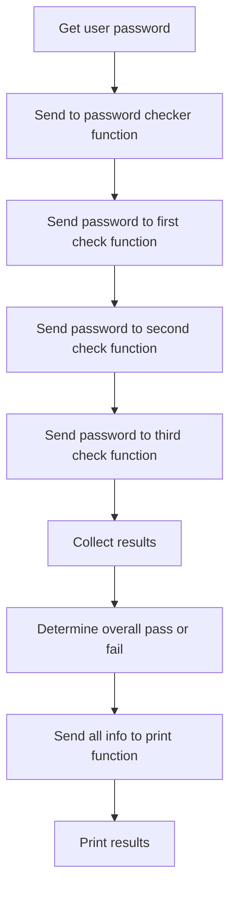

```mermaid
flowchart TD
A[Get user password] --> B[Send to password checker function]
B --> C[Send password to first check function]
C --> D[Send password to second check function]
D --> E[Send password to third check function]
E --> F[Collect results]
F --> G[Determine overall pass or fail]
G --> H[Send all info to print function]
H --> I[Print results]
```