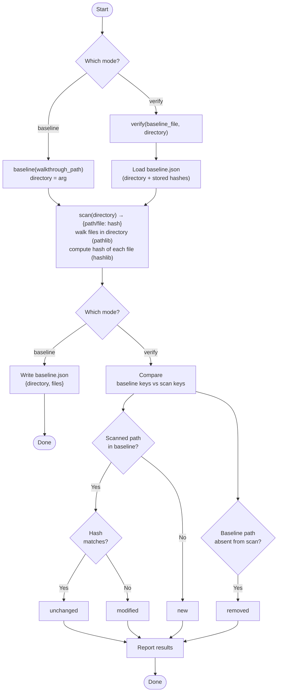

# Baseline / Verify Flow

Two modes: **baseline** (fingerprint a directory) and **verify** (diff a directory against a saved baseline).

Both modes pass through the same `scan()` step — walk (pathlib) + hash (hashlib) — so it appears
once, shared by both branches, rather than duplicated in each. The flow re-splits after it because
the result is *handled* differently (write it out vs. diff it), not because the scan differs.

Every verify check happens **after** the scan: `removed` needs the scan's key set, so it can't
run before the walk completes.

## Notes

- `scan()` is one shared step across both modes: walk + hash, returning `{path: hash}`. One
  function in code, one node in the diagram.
- Ordering in verify: load baseline → scan → compare → classify. `removed` consumes the scan's
  key set (`baseline_keys − scan_keys`), so it is downstream of the scan, not parallel to it.
- The mode is read twice — once to get the directory (arg vs. baseline.json) and once to decide
  what to do with the scan result. That second split is unavoidable: `baseline` writes the map
  out, `verify` diffs it.
- `removed` is a set difference over paths; the other three come from the per-file classification.

