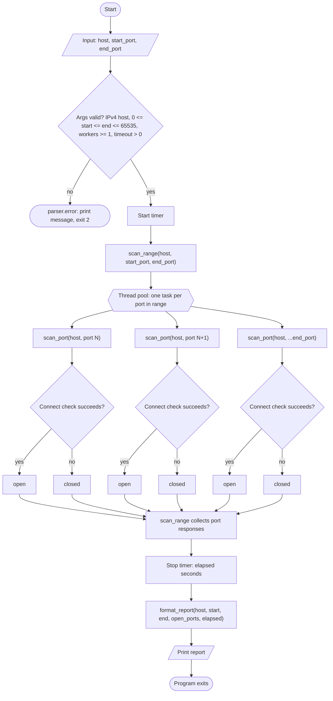

# Week 08 Port Scanner Logic

```mermaid
flowchart TD
    A([Start]) --> B[/"Input: host, start_port, end_port"/]
    B --> V{"Args valid? IPv4 host, 0 <= start <= end <= 65535, workers >= 1, timeout > 0"}
    V -- no --> X(["parser.error: print message, exit 2"])
    V -- yes --> T1["Start timer"]
    T1 --> C["scan_range(host, start_port, end_port)"]

    C --> D{{"Thread pool: one task per port in range"}}
    D --> E1["scan_port(host, port N)"]
    D --> E2["scan_port(host, port N+1)"]
    D --> E3["scan_port(host, ...end_port)"]

    E1 --> F1{"Connect check succeeds?"}
    E2 --> F2{"Connect check succeeds?"}
    E3 --> F3{"Connect check succeeds?"}

    F1 -- yes --> G1[open]
    F1 -- no --> H1[closed]
    F2 -- yes --> G2[open]
    F2 -- no --> H2[closed]
    F3 -- yes --> G3[open]
    F3 -- no --> H3[closed]

    G1 & H1 & G2 & H2 & G3 & H3 --> I["scan_range collects port responses"]
    I --> T2["Stop timer: elapsed seconds"]
    T2 --> J["format_report(host, start, end, open_ports, elapsed)"]
    J --> P[/"Print report"/]
    P --> K([Program exits])
```
