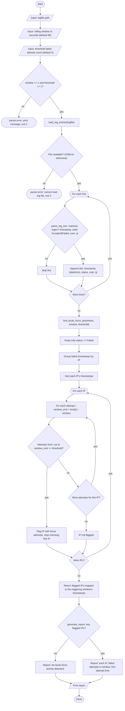

# Week 09 Brute Force Detector Logic

```mermaid
flowchart TD
    A([Start]) --> B[/"Input: logfile path"/]
    B --> C[/"Input: rolling window in seconds (default 60)"/]
    C --> D[/"Input: threshold failed attempt count (default 5)"/]
    D --> V{"window >= 1 and threshold >= 1?"}
    V -- no --> X1(["parser.error: print message, exit 2"])
    V -- yes --> E["load_log_entries(logfile)"]
    E --> R{"File readable? (OSError otherwise)"}
    R -- no --> X2(["parser.error: cannot read log file, exit 2"])
    R -- yes --> F{{"For each line"}}
    F --> G{"parse_log_line: matches regex? timestamp, sshd Accepted|Failed, user, ip"}
    G -- no --> H["Skip line"]
    G -- yes --> I["Append dict: timestamp (datetime), status, user, ip"]
    H --> J{"More lines?"}
    I --> J
    J -- yes --> F
    J -- no --> K["find_brute_force_ips(entries, window, threshold)"]
    K --> K0["Keep only status == Failed"]
    K0 --> K1["Group failed timestamps by IP"]
    K1 --> K2["Sort each IP's timestamps"]
    K2 --> K3{{"For each IP"}}
    K3 --> K4["For each attempt i: window_end = time[i] + window"]
    K4 --> K5{"Attempts from i up to window_end >= threshold?"}
    K5 -- yes --> K6["Flag IP with those attempts, stop checking this IP"]
    K5 -- no --> K7{"More attempts for this IP?"}
    K7 -- yes --> K4
    K7 -- no --> K8["IP not flagged"]
    K6 --> K9{"More IPs?"}
    K8 --> K9
    K9 -- yes --> K3
    K9 -- no --> L["Return flagged IPs mapped to the triggering window's timestamps"]
    L --> P{"generate_report: any flagged IPs?"}
    P -- no --> P1["Report: No brute-force activity detected."]
    P -- yes --> P2["Report: each IP, failed attempts in window, first attempt time"]
    P1 --> M[/"Print report"/]
    P2 --> M
    M --> N([Done])
```
